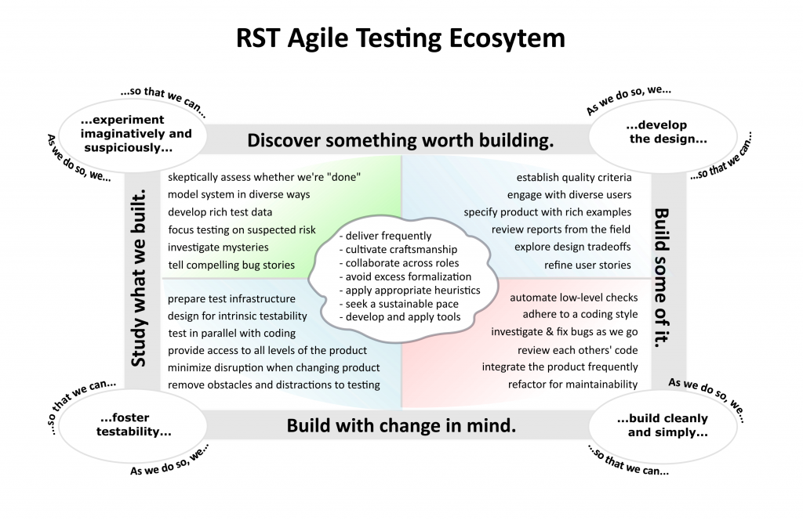
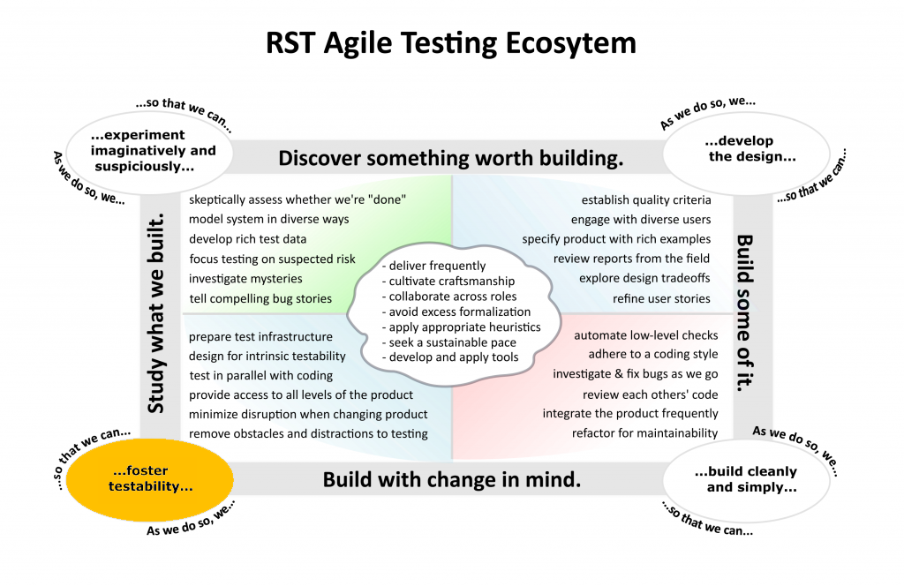
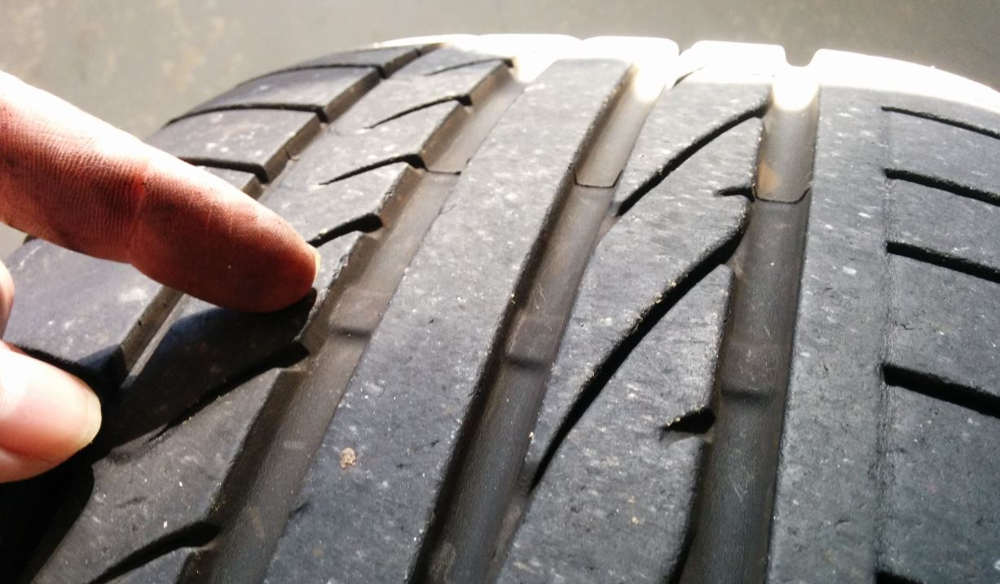
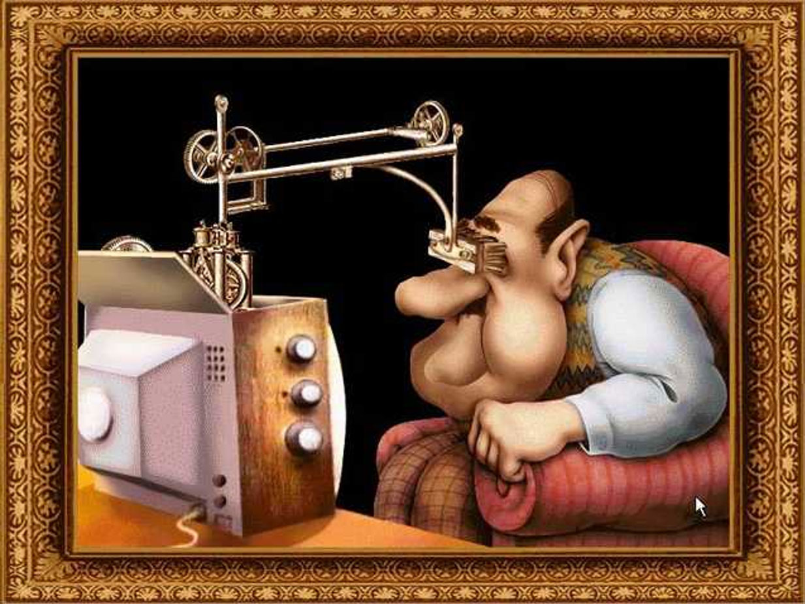

# WHAT IS TESTABILITY

---

# ABILITY

"The fact that someone or something is able to do something"

_Oxford dictionary_

---

# TEST

"Testing is the process of evaluating a product by learning about it through 
experiencing, exploring, and experimenting, which includes to some degree: 
questioning, study, modeling, observation, inference, etc."

_Michael Bolton, https://rapid-software-testing.com_

--

# Rapid Software Testing

- James Bach and Michael Bolton
- Evolved form "Exploratory Testing" and "Context Driven Testing"
- Started around 1987

---



---


<!-- .slide: data-transition="none" -->

---


# TESTABILITY IN CARS
- Tire tread level indicators
- 1,6 mm is the legal requirement
- But ~3 mm is needed when it's raining
- Requires a minimum of skills

---



---

# WHAT IT's _NOT_
- Dieselgate
```
if (car_is_under_test):
	behave_nice() # They're watching!
else:
	misbehave() # And hope we'll not get caught…
```

--

- Not only VW
	- BMW, Chrysler, Fiat, Jeep, Nissan, Opel, Renault, Mercedes-Benz…
- Not only now
	- 1973 Chrysler, Ford, General Motors, Toyota and Volkswagen
	- 1996 General Motors, Fiat
	- 1998 Honda

---

# DEMO ABR
- Hvad er ABR (samme film, men forskellige bitrater, forskellig lyd og video)
- Need to know what is actually offered to the client (manifest proxy)
- TvE004 ABR

---

# DEMO LIPP SYNC
- TvE00x

---

# DEMO DOLBY SURROUND
-TvE00x


# DEMO LIMITATIONS
- Our platform "difficult"
- Requires a subscription for "cmore"
- Not possible to have "free" "available for all" content (yet)


---

# Spørgsmål


---
<!-- .element: class="fragment" -->
