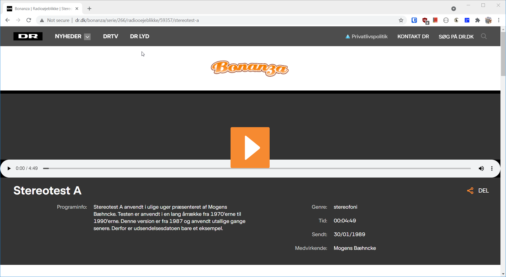

# WHAT IS TESTABILITY
- Thomas von Eyben, the BOX Squad

--

# FIT TO FRAME
- Teams: Right click and select ***Fit to frame*** to see the entire video

---

## ABILITY

> The fact that someone or something is able to do something

_Oxford Advanced Learner's Dictionary_

---

## TEST

> Testing is the process of evaluating a product by learning about it through 
experiencing, exploring, and experimenting, which includes to some degree: 
questioning, study, modeling, observation, inference, etc.

_James Bach & Michael Bolton_

_https://rapid-software-testing.com_

--

## Rapid Software Testing

- James Bach and Michael Bolton
- Evolved form
	- "Exploratory Testing"
	- "Context Driven Testing"
- Started around 1987

---


---


<!-- .slide: data-transition="none" -->

---


## TESTABILITY - CARS
- Tire tread level indicators
- 1,6 mm is the legal requirement
	- But ~3 mm is needed when it's raining
- Requires a minimum set of skills to use
	- Even a small child can do it

---


---

## TESTABILITY IS _NOT_
- Dieselgate!

```
if (car_is_under_test):
	behave_nice() # The authorities are watching us!
else:
	misbehave()   # And hope we'll not get caught…
```

--

## NOT NEW
- Everybody cheats
	- BMW, Chrysler, Fiat, Jeep, Nissan, Opel, Renault, Mercedes-Benz…
- All the time
	- 1973 Chrysler, Ford, General Motors, Toyota and Volkswagen
	- 1996 General Motors, Fiat
	- 1998 Honda

---

## ADAPTIVE BITRATE DEMO
- A "manifest" defines multiple technical variations
	- EG.: 1, 2, 4 & 8 Mbps
- Different clients gets different manifests (proxy-server)
	- Humax: 8 Mbps, iOS 4 Mbps

- TvE004

---

## LIPP SYNC DEMO
- Using an external amplifier?
- Is audio and video in sync?
- TvE003

---

## DOLBY SURROUND DEMO
- Using a surround amplifier?
- Is right and left swapped?
-TvE002

--

# STEREOTESTEN 1970


_https://www.dr.dk/bonanza/serie/266/radiooejeblikke/59357/stereotest-a_

---

## DEMO CHALLENGES
- Our platform is _difficult_
- _[TvE00x]_ Requires a subscription for "C-More"
- Not possible to have "available for all" content (yet)


---

## TAKE AWAY
- If testing made is easy
	- it ***will*** be performed (much more)
- If testing is made difficult
	- it will ***not*** be performed (as much as needed)
- Must know the actual requirements
	- Client max bitrate


--

# Picasso?
***Good artists copy, great artists steal***

> A good artist will see another artists style and then try and emulate that style as closely as they can

> A great artist will select elements from another artists work and incorporate it into their own unique mix of influences

---


## Questions


_https://tveyben.github.io/testability_
